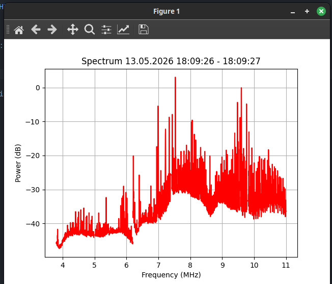

# Simple program for RTL-SDR that produces visual RSSI spectrum of selected freq. range. 

Uses pyplot and pyrtlsdr

### libaries
pyrtlsdr library: https://pypi.org/project/pyrtlsdr/ 

Can be installed with "pip install pyrtlsdr[lib]"